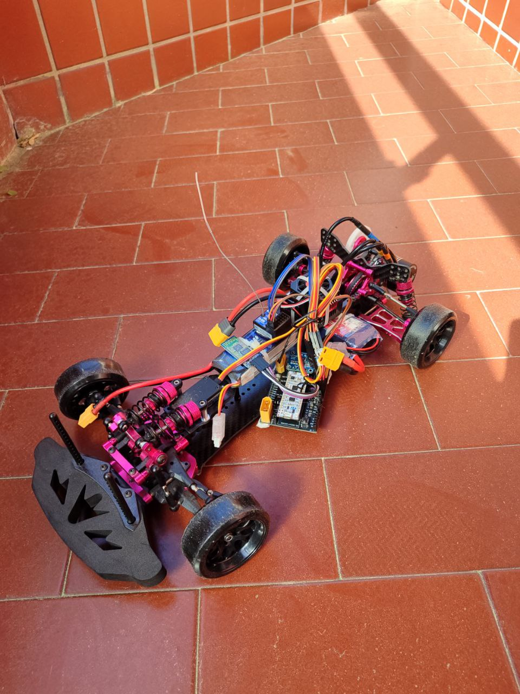
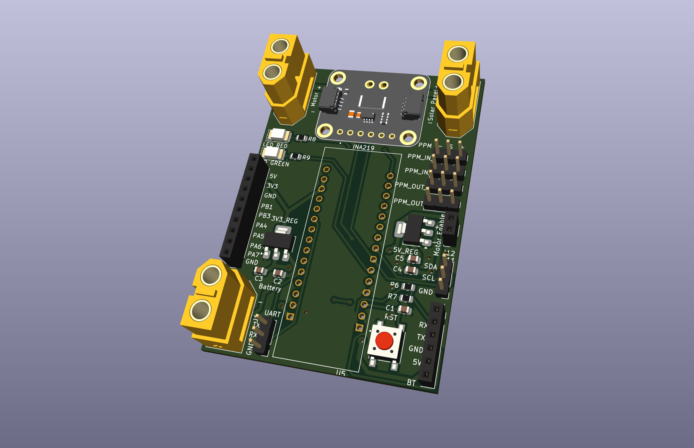

# RC Car Project




This repository contains all the necessary files and resources to design, configure, and develop an RC car. The project is organized into three main folders:

## Folder Structure

### 1. `kicad/` - Hardware Design

This folder contains the hardware design files for the RC car, created using KiCad. It includes:

- PCB layout files (`.kicad_pcb`)
- Schematic files (`.kicad_sch`)
- Gerber files for manufacturing
- Drill files and reports

### 2. `stm32-cube-ide/` - STM32L432KC Configuration

This folder contains the configuration files for the STM32L432KC microcontroller, set up using STM32CubeIDE. It includes:

- Peripheral initialization
- Clock configuration
- Pin assignments

### 3. `platformio/` - Firmware Development

This folder contains the firmware source code for the RC car, developed using PlatformIO. It includes:

- Source code for motor control, sensors, and communication
- Configuration files for PlatformIO
- Unit tests for firmware components

## Getting Started

### Prerequisites

- [KiCad](https://kicad.org/) for hardware design
- [STM32CubeIDE](https://www.st.com/en/development-tools/stm32cubeide.html) for microcontroller configuration
- [PlatformIO](https://platformio.org/) for firmware development

### Steps to Build the RC Car

1. **Hardware Design**: Open the `kicad/` folder in KiCad to view and modify the PCB and schematic designs. Generate Gerber files for manufacturing.
2. **Microcontroller Configuration**: Open the `stm32-cube-ide/` folder in STM32CubeIDE to configure the STM32L432KC microcontroller.
3. **Firmware Development**: Use PlatformIO to write and upload firmware to the microcontroller. Navigate to the `platformio/` folder and run:

   ```sh
   make build_embedded

## Shopping list

### Nucleo

[STM32L432KC](https://www.digikey.es/es/products/detail/stmicroelectronics/NUCLEO-L432KC/6132763)

### Radio

[Goolsky Flysky FS-GT5 2.4G 6CH Transmitter Remote Controller with FS-BS6 Receiver for RC Car Crawler Boat](https://a.co/d/gxiTpZ9)

### Car

[AXSPEED-Kit](https://es.aliexpress.com/item/1005004083219971.html?spm=a2g0o.order_list.order_list_main.313.2c05194ddy0I9h&gatewayAdapt=glo2esp)

### Motor

[Rocket-Motor](https://es.aliexpress.com/item/1005003152797506.html?spm=a2g0o.order_list.order_list_main.278.2c05194ddy0I9h&gatewayAdapt=glo2esp)

### Servo

[INJORA-Servo Digital](https://es.aliexpress.com/item/1005005066982557.html?spm=a2g0o.order_list.order_list_main.273.2c05194ddy0I9h&gatewayAdapt=glo2esp)

### Batteries

[Zeee 2S Lipo Batería 50C 2200mAh 7.4V Batería Corta con Enchufe XT60](https://amzn.eu/d/79buMsG)

[Motor Battery](https://es.aliexpress.com/item/1005004770752418.html?spm=a2g0o.order_list.order_list_main.223.2c05194ddy0I9h&gatewayAdapt=glo2esp)
